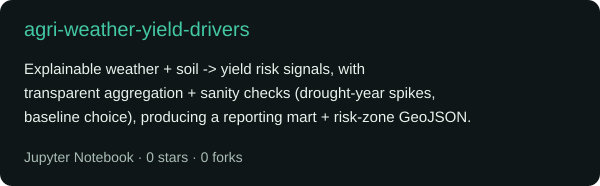
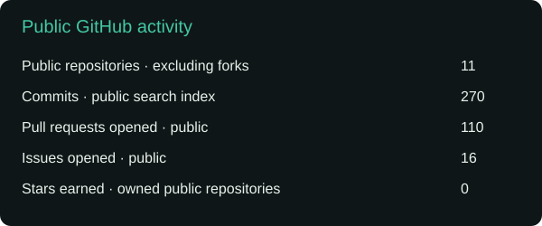

<h1 align="center">Hi, I'm Katerina Zhittsova 👋</h1>

  <strong>Data & ML Engineer building forecasting and analytics systems for renewables, energy infrastructure, and power systems</strong>

  Renewable energy analytics • Energy-system forecasting • Renewable siting • Geospatial analytics • ETL/ELT systems

  <a href="https://zhittsova.com/portfolio">Portfolio</a> •
  <a href="https://zhittsova.com/blog">Blog</a> •
  <a href="https://zhittsova.com/cv">CV</a> •
  <a href="https://linkedin.com/in/zhittsova">LinkedIn</a>

---

### What I work on

I build data and ML systems for forecasting, analytical decision support, and infrastructure-facing applications across renewables, energy systems, and power-sector workflows.

My work includes:

- renewable energy and energy-system analytics
- forecasting and analytical workflows for operational and infrastructure decision support
- renewable siting and geospatial workflows
- weather and environmental data pipelines
- ETL/ELT systems that turn exploratory analysis into maintainable production assets

- 🌱 I’m currently deepening my skills in **scalable ML systems, data platform architecture, and production-grade tooling**
- 🤝 I’m open to collaboration on **renewable energy analytics, energy-system forecasting, and geospatial decision-support workflows**

### Selected public work

<table>
  <tr>
    <td align="center">
      
    </td>
  </tr>
</table>

**agri-weather-yield-drivers**
A public analytical project using weather, yield, soil, and geospatial signals for renewable siting and environmental intelligence, with reproducible notebook-based research evolving into a more explicit ETL/ELT and production-oriented structure.

### Core stack

`Python` · `PyTorch` · `scikit-learn` · `pandas` · `NumPy` · `FastAPI` · `PostgreSQL` · `DuckDB` · `Docker` · `AWS` · `TypeScript` · `React` · `Astro` · `Jupyter`

### Ask me about

- renewable energy analytics
- energy-system forecasting
- solar siting and yield drivers
- geospatial and environmental data workflows
- ETL/ELT architecture for analytical systems
- Python-based ML and data engineering

### Connect

  
  

### GitHub snapshot

  

