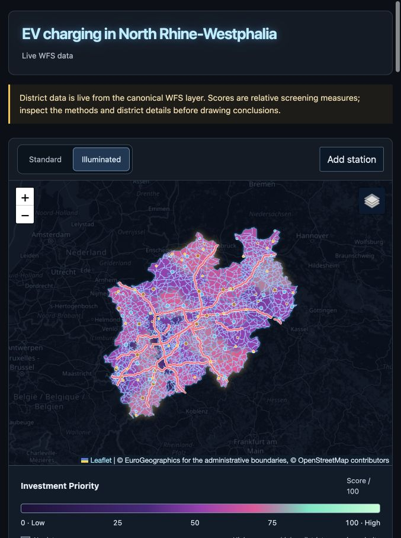
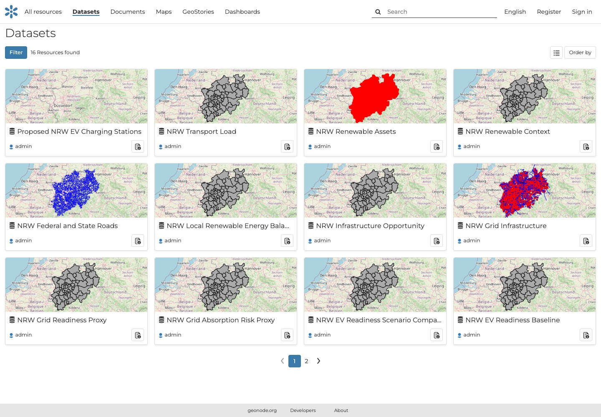
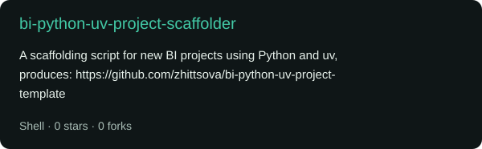
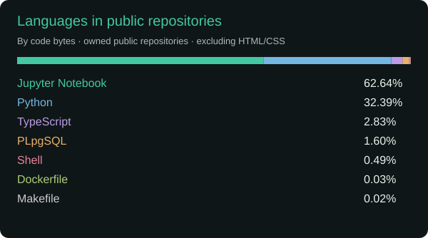

<h1 align="center">Hi, I'm Katerina Zhittsova 👋</h1>

  <strong>Data & analytics engineer · Energy, geospatial BI and forecasting</strong>

  <a href="https://zhittsova.com/portfolio">Portfolio</a> ·
  <a href="https://zhittsova.com/blog">Blog</a> ·
  <a href="https://zhittsova.com/cv">CV</a> ·
  <a href="https://linkedin.com/in/zhittsova">LinkedIn</a>

I build data pipelines and analytical applications for energy and infrastructure decisions. I'm interested in the whole path from a business question to a working tool: choosing the data, making assumptions explicit, and giving people a way to investigate the result.

My current work brings together geospatial BI, energy and renewables analytics, and reproducible Python and SQL workflows. I'm also developing my forecasting and data-platform skills.

## Selected work

### NRW Charging Atlas

Where should a charging operator expand next? I built [NRW Charging Atlas](https://github.com/zhittsova/nrw-charging-atlas) to support early siting decisions for operators planning charging infrastructure for electric vehicles (EV) across all 53 districts in North Rhine-Westphalia (NRW), Germany.

You can screen districts for a rollout, inspect what drives their priority rankings and test proposed stations against current coverage. I pushed spatial joins and scoring into PostGIS, with Python for data validation and loading, GeoServer for map and feature services, and GeoNode for dataset discovery and metadata.

[Explore the code](https://github.com/zhittsova/nrw-charging-atlas) · [Read the project story](https://zhittsova.com/blog/nrw-charging-atlas-geonode-postgis/) · [Try the visual walkthrough](https://zhittsova.com/blog/nrw-charging-atlas-local-walkthrough/) · [Open the slides](https://zhittsova.com/slides/nrw-charging-atlas.pdf)

Look inside the GeoNode dataset catalogue

The catalogue keeps published layers and their source information together. Proposed stations start empty; district layers share boundaries, so their previews can look alike even though their values differ.

Map previews: © EuroGeographics and © OpenStreetMap contributors.

### Weather, soil and crop-yield risk

[agri-weather-yield-drivers](https://github.com/zhittsova/agri-weather-yield-drivers) combines weather, soil and yield data into explainable risk signals. The work includes checks on spatial joins, coverage and baseline choices, with a reporting mart and risk-zone GeoJSON as outputs.

### A repeatable start for Python BI projects

[bi-python-uv-project-scaffolder](https://github.com/zhittsova/bi-python-uv-project-scaffolder) creates a starting structure for BI projects using Python and uv. It supports the practical setup work behind repeatable analytical pipelines.

## From the blog

- [NRW Charging Atlas: comparing charging coverage with GeoNode and PostGIS](https://zhittsova.com/blog/nrw-charging-atlas-geonode-postgis/): the siting question, scoring model and data pipeline.
- [A quick tour of NRW Charging Atlas](https://zhittsova.com/blog/nrw-charging-atlas-local-walkthrough/): start the application, try a proposed station and explore the data services.
- [Crude benchmarks: API, sulfur and interactive charts](https://zhittsova.com/blog/crude-benchmarks-api-vs-sulfur-interactive-artifacts/): explore crude quality through interactive charts.

[All posts](https://zhittsova.com/blog/) · [Subscribe by RSS](https://zhittsova.com/rss.xml)

## Tools I work with

`Python` · `SQL` · `PostgreSQL / PostGIS` · `DuckDB` · `GeoNode` · `GeoServer` · `pandas` · `NumPy` · `scikit-learn` · `PyTorch` · `Power BI` · `Docker` · `AWS` · `TypeScript` · `React`

## GitHub activity

Languages across my public repositories

I'm open to conversations and collaboration around energy analytics, geospatial BI and forecasting. [Find me on LinkedIn](https://linkedin.com/in/zhittsova) or [explore my portfolio](https://zhittsova.com/portfolio).
